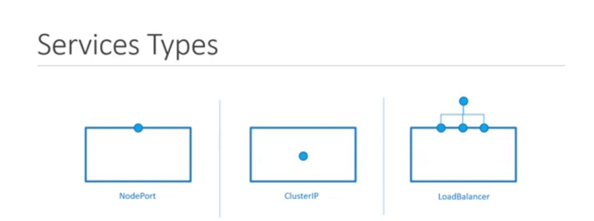
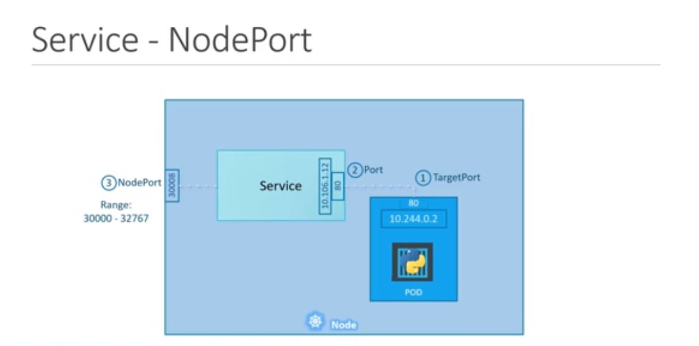

## Service

Kubernetes services enable communications between different components within and outside of the application.it is helps us connect the app with other applications or users. For example, over-application as groups of pods, one group frond-end another one back-end, middleware groups. Using services connect frond-end and middleware, back-end as a loose connection.

service are 3 types
- NodePort
- ClusterIP
- LoadBalancer

**NodePort:**

NodePort is service that connect with port number .
example i have server that i deployed my application as container
so have ip address of that worker node. so in case of nodePort service can connect to container port and it links with server physical IP.

see above image the pod internal port 80 connect with service virtual ip and port 80 then again connect Nodeport port with range of 3000 to 32767.

