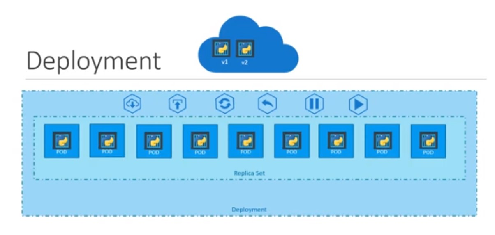

## Deployments

   Deployment is on main object of kubernetes. 
   
   **explanation:**
   
   Say for example; we need to deploy lots of httpd application pods in the production environment. In this case, the newer version of httpd image available in docker hub and we would like to upgrade docker instances seamlessly. However, we don't want an upgrade at a time for all containers because it will cause by production impact. So we need to upgrade one after one this method called rolling update.
   
   
   